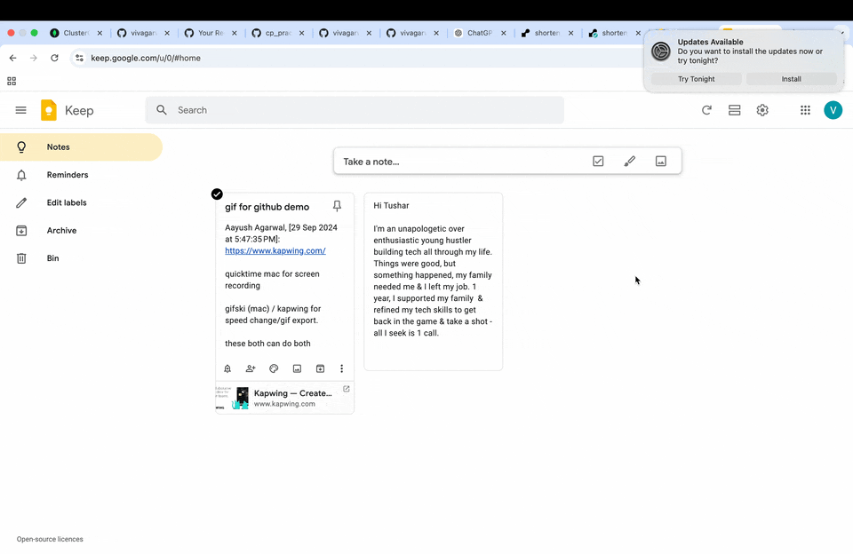

# 🚀 URL Shortener

🎉 Welcome to the **URL Shortener**! This is a simple and efficient full-stack application that allows users to shorten URLs and manage them. The backend is built using **Node.js** and **Express**, with **MongoDB** as the database. The frontend is deployed on **Vercel**, and the backend is hosted on **Render**.

---

## 🌐 Live Demo

You can check the live version of the app:

🔗 [https://shorten-url-frontend.onrender.com/](#)
---

### 🎥 Application Demo



---

## 🌟 Features

- 🔗 **Shorten URLs**: Generate short URLs for long links.
- 📊 **Click Tracking**: Track the number of clicks for each shortened URL.
- 🛠 **RESTful API**: Fully functional API to handle URL shortening and redirection.
- 🌐 **Frontend-Backend Communication**: The app seamlessly integrates frontend and backend for smooth operations.

---

## 🖥️ Technologies Used

- **Backend**: [Express.js](https://expressjs.com/) (Node.js)
- **Frontend**: [React.js](https://reactjs.org/) (or adjust if not React-based)
- **Database**: [MongoDB](https://www.mongodb.com/)
- **Hosting**:
  - **Frontend**: [Vercel](https://vercel.com/)
  - **Backend**: [Render](https://render.com/)

---

## 🚀 API Endpoints

Here’s a quick overview of the API endpoints:

- **POST** `/api/shorten`  
  Create a short URL for a given long URL.
- **GET** `/api/:shortUrl`  
  Redirect the short URL to its original destination.
- **GET** `/api/stats/:shortUrl`  
  Fetch click statistics for a short URL.

---

## 🔧 How to Run the Project Locally

1. **Clone the repository**:
   ```bash
   git clone <new-repository-url>
   cd url-shortener
   ```

2. **Backend Setup**:
   1. Navigate to the backend directory:
      ```bash
      cd backend
      ```

   2. Install dependencies:
      ```bash
      npm install
      ```

   3. Create a `.env` file in the backend directory and add the following:
      ```plaintext
      MONGO_URI=<Your MongoDB Connection String>
      PORT=5000
      BASE_URL=http://localhost:5000
      ```

   4. Start the backend server:
      ```bash
      npm start
      ```

   The backend will now be running at `http://localhost:5000`.

3. **Frontend Setup**:
   1. Navigate to the frontend directory:
      ```bash
      cd ../frontend
      ```

   2. Install dependencies:
      ```bash
      npm install
      ```

   3. Create a `.env.local` file in the frontend directory with the following:
      ```plaintext
      REACT_APP_BACKEND_URL=http://localhost:5000
      ```

   4. Start the frontend development server:
      ```bash
      npm run dev
      ```

   The frontend will now be running at `http://localhost:3000`.

---

## 📦 Deployment

### Backend Deployment on Render:
1. Push your backend code to a repository (if not already done).
2. Log in to [Render](https://render.com/) and create a new Web Service.
3. Add environment variables:
   - `MONGO_URI`
   - `PORT` (default is 5000)
   - `BASE_URL` (e.g., your Render backend URL)
4. Deploy the service and note down the live URL.

### Frontend Deployment on Vercel:
1. Push your frontend code to a repository.
2. Log in to [Vercel](https://vercel.com/) and create a new project.
3. Set up the build command:
   ```bash
   npm run build
   ```
4. Set environment variables:
   - `REACT_APP_BACKEND_URL` (e.g., your Render backend URL)
5. Deploy the project.

---

## 📝 Example API Calls

Here are a few example requests:

1. **Shorten a URL**:
   ```json
   POST /api/shorten

   {
     "originalUrl": "https://www.example.com"
   }
   ```

   **Response**:
   ```json
   {
     "shortUrl": "http://localhost:5000/abc123"
   }
   ```

2. **Fetch Statistics**:
   ```json
   GET /api/stats/abc123

   **Response**:
   {
     "originalUrl": "https://www.example.com",
     "clicks": 42
   }
   ```

---

## 🤝 Contributing

Contributions are welcome! Feel free to fork this repository and submit a pull request.

---

## 🔒 License

This project is licensed under the MIT License. See the [LICENSE](LICENSE) file for more details.

---

## 📬 Contact

For any questions, feel free to reach out via email or open an issue in the repository.

---

🎉 **Thank you for checking out the project! Happy Coding!**

---

### Placeholders to Fill:
1. Replace `<new-repository-url>` with the GitHub repository URL.
2. Replace `<Your MongoDB Connection String>` with your MongoDB connection string.
3. Replace `Frontend URL` and `Backend API URL` with live deployment links.
4. Add more API details if applicable.

Let me know if you'd like further modifications!
